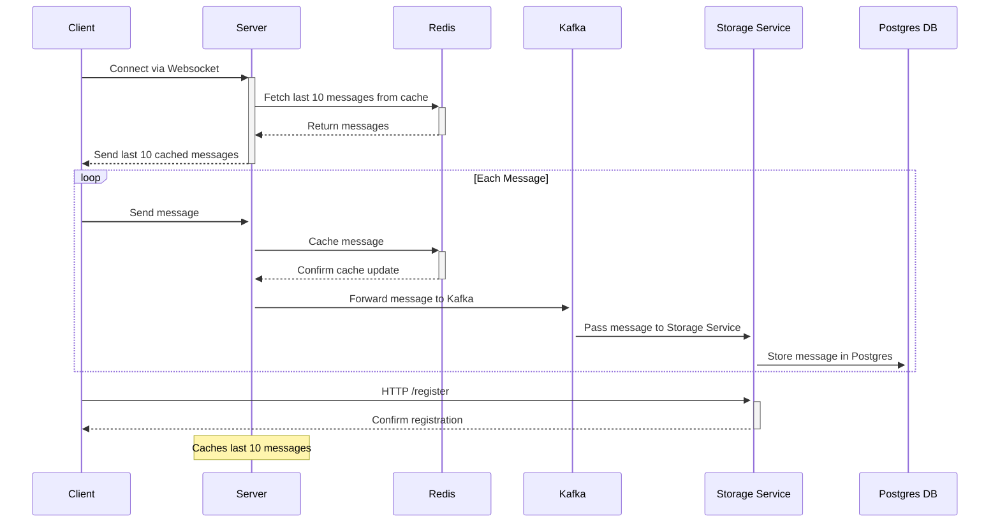

# Single group chat
## Build
#### Prerequisites
- Docker 26.0.0
- Makefile 3.81

1. Clone project:
```
git clone git@github.com:vlasashk/websocket-chat.git
cd websocket-chat
```
2. Run:
   1. Server
        ```
        make run_server
        ```
   2. Client
         ```
         make run_client
         ```
3. Test:
```
make test_server
```
## Project information

### Architecture


### Restrictions/Peculiarities
- Single chat group - server as a single space for all clients (all clients communicate in a single common space)
### Tools used
- PostgreSQL as database
- [jackc/pgx](https://pkg.go.dev/github.com/jackc/pgx) package as toolkit for PostgreSQL
- [go-chi/chi](https://pkg.go.dev/github.com/go-chi/chi) package as router for building HTTP service
- [rs/zerolog](https://github.com/rs/zerolog) package for logging
- [stretchr/testify](https://github.com/stretchr/testify) package for testing
- [redis/go-redis](https://github.com/redis/go-redis) package for redis client
- [segmentio/kafka-go](https://github.com/segmentio/kafka-go) package for kafka interaction
- Docker for deployment